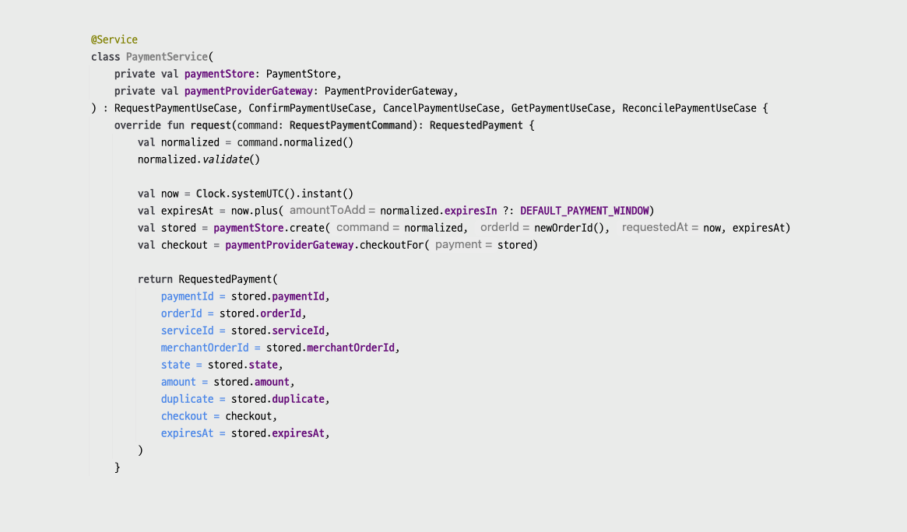

# Graphite Theme



## English

Graphite Theme is a quiet paper-and-ink theme for IntelliJ Platform IDEs.

Built from the design system of my personal blog, it pairs a soft paper
background with graphite ink. When the code gets loud, the screen stays
calm—one small aid for becoming the developer who does not get angry at the
compiler. :)

## 한국어

개인 블로그를 운영하며 사용하던 디자인 시스템을 IntelliJ Platform 테마로
만들었습니다.

종이 배경에 먹색을 조합한 차분한 테마입니다. 코드가 시끄러워질수록 화면은
조용하게. 컴파일러에게 화내지 않는 개발자가 되기 위한 작은 장치입니다. :)

## Features

- IntelliJ Light 기반 Paper / Graphite Ink palette
- D2Coding 13px editor and console scheme
- Paper-like editor background, graphite UI, low-saturation syntax colors

## Install

1. [Releases](../../releases)에서 최신 ZIP을 내려받는다.
2. IntelliJ IDEA에서 `Settings | Plugins | ⚙ | Install Plugin from Disk...`를 연다.
3. ZIP을 선택하고 IDE를 재시작한다.
4. `Settings | Appearance & Behavior | Appearance`에서 `Graphite Theme`을 선택한다.

`D2Coding`이 설치되어 있지 않으면 IDE 기본 monospace font를 사용한다.

## Build

```sh
./package.sh
```

`dist/ark-graphite-intellij-theme.zip`이 생성된다. 이 플러그인은 코드나 외부
의존성이 없는 리소스 전용 테마다.

## License

Copyright 2026 Eunwoo Park.

Distributed under the [Apache License 2.0](LICENSE).
